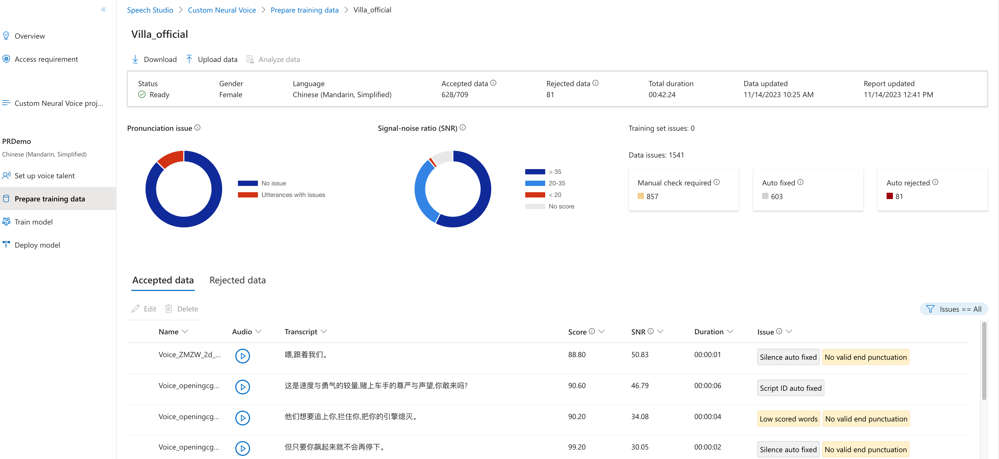

## 1. 语音合成的基本流程

## 2. 从一个 DNN 算法范例入手

[Bert-VITS2](https://github.com/fishaudio/Bert-VITS2)

### VITS vs Fastpitch

### 代码分析

### 实验结果

## Azure 的 Voice Cloning

### 数据准备

#### 1. 要求数据内容

- 音频文件包（.zip格式）
- 音频文件对应的内容文本（.txt格式）

```text
<音频文件名1> <音频文件内容1>
<音频文件名2> <音频文件内容2>
...
```

范例：

```text
0001.wav    你好
0002.wav    再见
...
```

#### 2. 数据准备

因为实验中开始未获得音频文件对应的文本，所以需要先将音频文件转换为文本。

这里采用了性能相对较好的 Whisper Speech-to-Text API。[参考链接](https://github.com/openai/whisper)

#### 3. 上传并制作数据集



### 训练并部署模型

