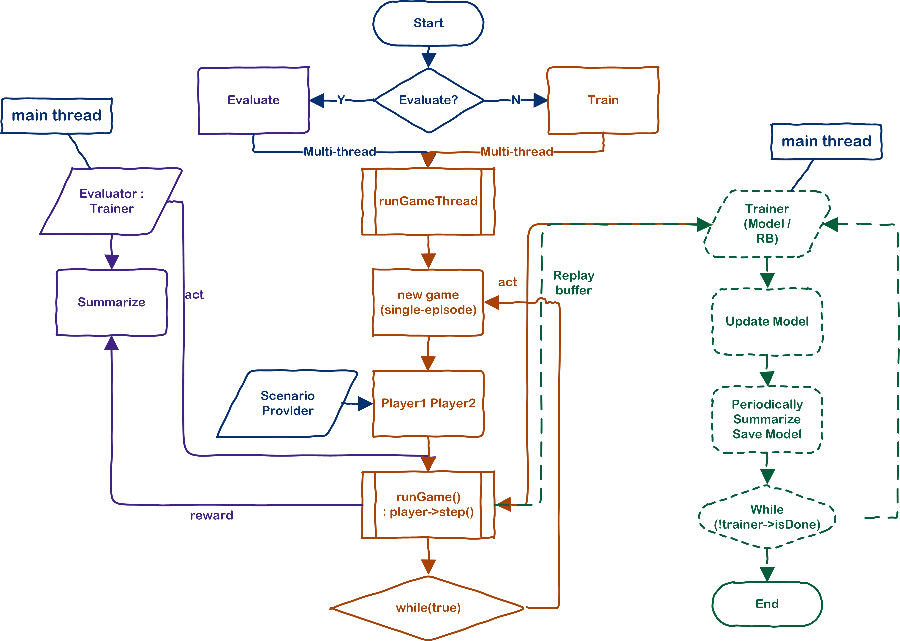
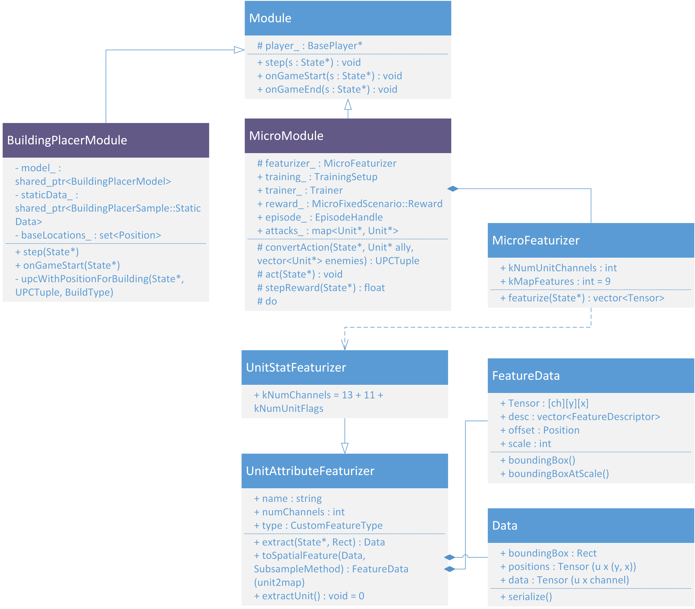
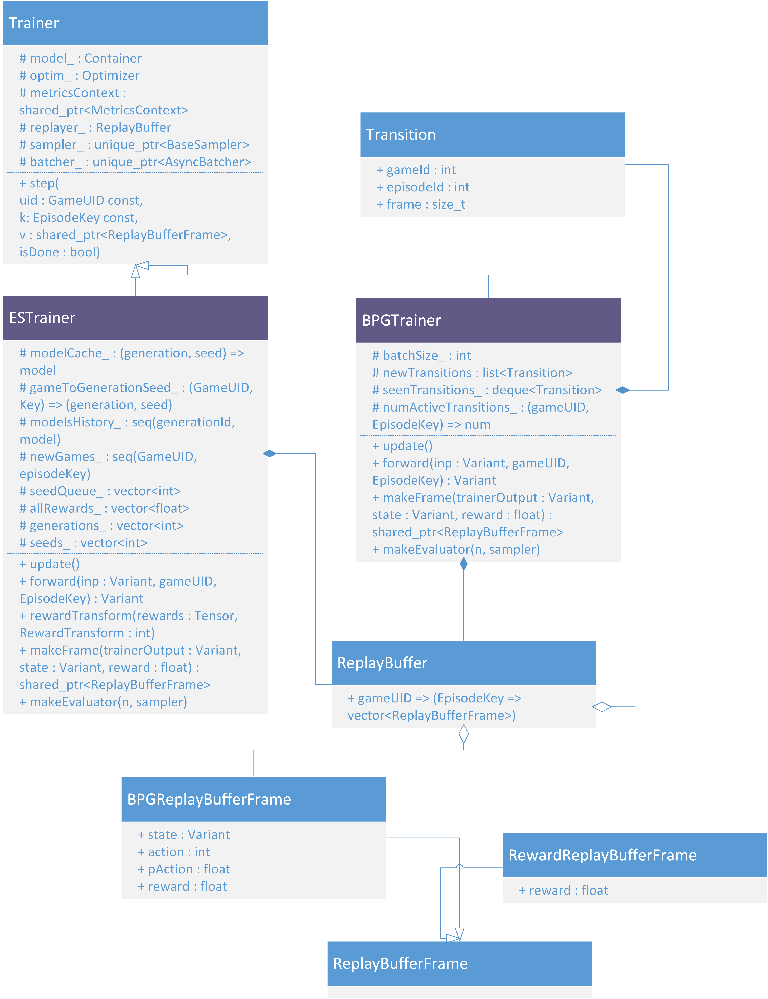
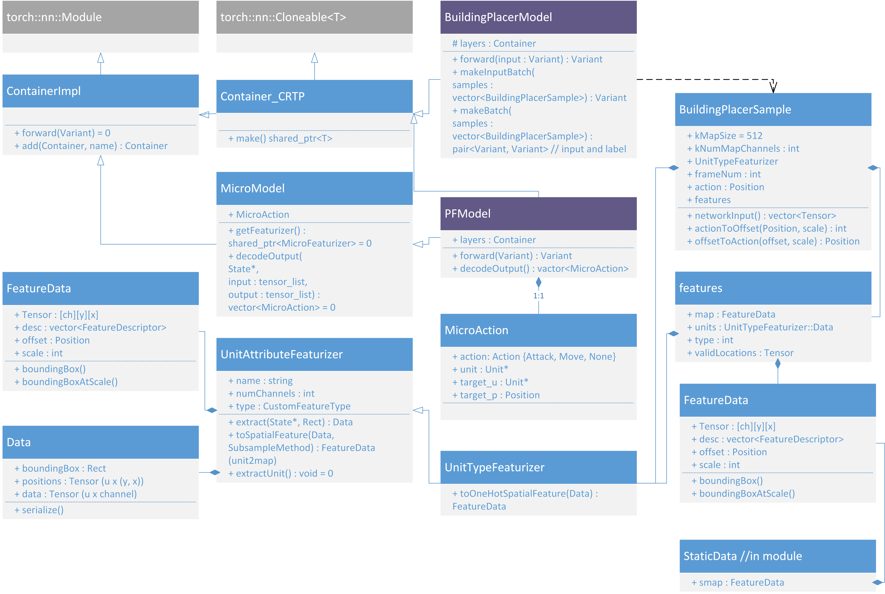
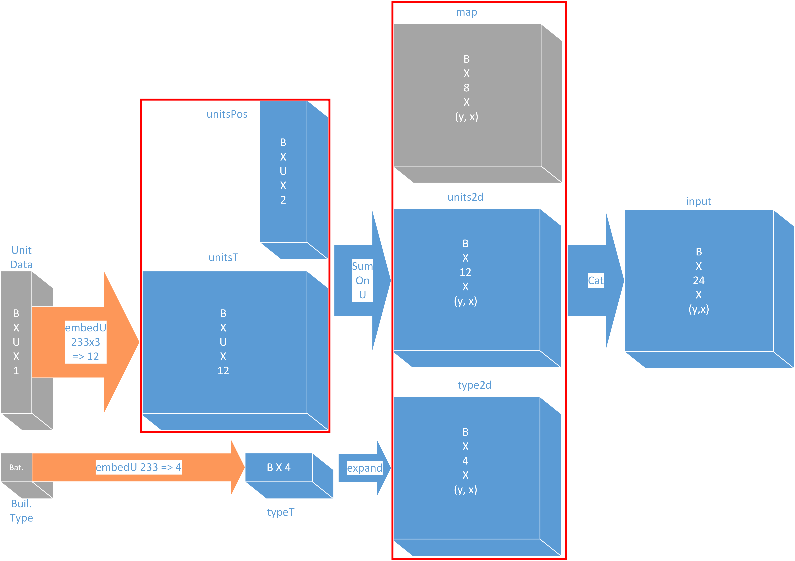
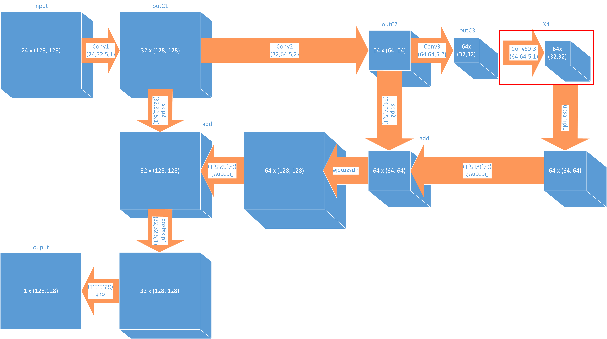
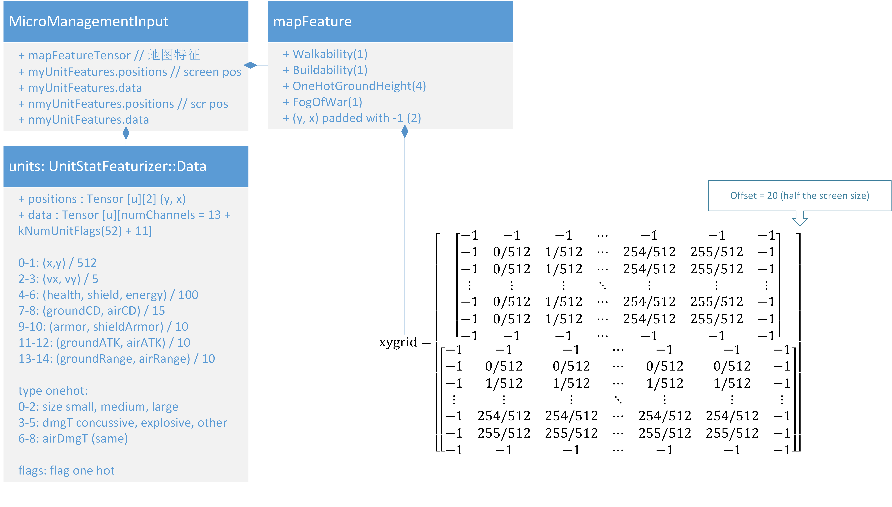
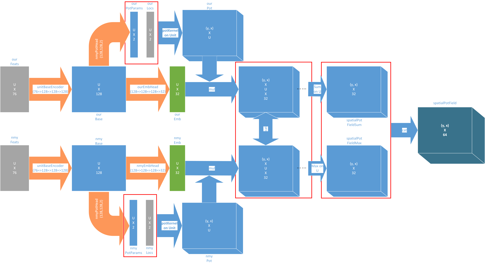

## Building Placer流程

入口函数为./tutorials/building-placer/train-rl.cpp

主要逻辑流程如下图：

<center></center>

* trainer loop中每回合使用replay buffer中的episode样本policy gradient方式更新当前模型
* 交互thread loop中每个线程用当前最新版本模型进行游戏，记录episode和reward

代码流程图：



* 代码流程中绿色框图对应模型更新部分，棕色框图对应游戏交互和replay buffer部分，紫色框图对应evaluation部分
* player->step()中调用模型

基本模块分析如下：

### Scenario类

提供游戏环境，通过ScenarioProvider::spawnNextScenario()来生成游戏，设置player参数

### Player类

Player继承自BasePlayer类，继承关系如下：

<center></center>

* Player包含多个Module，每个Module负责一种操作
* 由step()方法与游戏环境交互通信
  * 调用Module::step(state)获得操作游戏的命令（UPC/Command）
  * 由client_->send(commands)将命令发送至server
  * 通过成员变量State\*获得游戏状态信息

### State类

* 作为Bot Module的主要输入输出接口，可以读取游戏状态的各种信息
* 包含blackBoard类，用于优化命令

### Module类

* Module类为实现玩家操作的重要接口，可以实现为某一具体操作的封装。
* 在此被实现为了BuildingPlacerModule和MicroModule用以进行建筑物放置和微操的执行
* Module类的实现与Trainer一一对应，由setTrainer()方法设置Trainer
* 在Module类中调用了特征提取器Featurizer获得state对应的模型特征
* 在Module类中完成了Model类初始化以及Model::forward()方法以推理得到更新后的upc
* 同时记录Replay Buffer

继承关系如下：



### Trainer类

包含

* `算法` - （如DQN，PPO）包含stepFrame()，stepEpisode()，stepGame()等接口，分别在帧结束，回合结束和游戏结束时调用来实现算法操作
* `模型` - Model类，由外部定义
* `优化器` - 外部定义，多节点可能维护多个优化器
* `采样器` - 将模型输出结果转化为可执行action，如argmax(softmaxt)等
* `replay buffer` - 由算法实现

继承关系如下图：



### Model类

* 使用CRTP模式管理实例

Model类继承关系如下图：



* 同时还维护输入特征数据的提取模块，包括
  * 不随游戏进程改变的地图或玩家相关特征StaticData
  * 时变地图相关特征MapFeature
  * 时变单位相关特征UnitTypeFeaturizer::Data

特征类继承关系图如下：

<center></center>

特征生成逻辑框图如下：



* 维护一个DNN模型，并提供forward(Variant)接口，通过grad更新参数

DNN模型逻辑框图如下：



### 监督学习策略

监督学习的输入和输出与强化学习策略一致。分别为当前state的提取特征和指定建筑物的放置位置概率分布

#### 数据预处理

数据源来自[StarData](https://github.com/TorchCraft/StarData)
_replay中包含两部分：actionList和replayer（提供具体states信息）_

##### 预处理流程

* 筛选replay中为zerg种族对战的样本
* 在actionList中筛选出建造命令，且建造类型与player种族一致
* 同步循环actionList和replayer，将通过验证的frame提取特征存为新的样本集

##### 训练流程

```text
repeat until convergence {
  foreach minibatch (x, y) in corpus {
    o = M_θ(x);
    l = loss(y, o);
    ∇ = backprop(l, θ)
    θ = optimize(θ, ∇)
  }
}
```

样本集被送入与强化学习一样的CNN模型中，输出tilePosition的概率分布

$$
\begin{align}
    \mathcal{o} &= \mathcal{M_\theta}(x) \newline
    &= \mathcal{P}(tilePosition) \newline
    &= \mathcal{F_{CNN}}(stateFeature)
\end{align}
$$

损失函数为NLLLoss(Negative Log Likelihood Loss)。对于mini batch（N）：

$$
\begin{align}
    \mathcal{l} &= \mathcal{Loss}(y, o) \newline
    &= \frac{1}{N}\cdot\sum_{n = 1}^{N}{o_{n,y_n}}
\end{align}
$$

其中$o_{n,y_n}=o_n[i]\ \text{where}\ y_n[i] = 1$

更新部分：

$$
\begin{align}
    v_t &= \beta v_{t-1} + (1 - \beta)\nabla  \newline
    \theta &= \theta - \alpha v_t
\end{align}
$$

## Micro Management流程

入口函数为./tutorials/micro/micro_tutorial.cpp

算法流程与Building Placer相似，区别为模型训练机制为Evolution Strategies

### Evolution Strategies

模型更新方法如下：
<center></center>

* 其中红框范围内是model history记录的历史模型
* 在每一次update过程中每一个空闲线程会对当前模型（current model/latest model）加入参数扰动生成新的衍生模型（perturbed model）并利用衍生模型进行游戏并记录replay
* 若在update时未能结束游戏则不参加此轮更新
* 对所有参与更新的report根据reward进行排序，由高到低依次赋予递减权重，并将其参数diff加权加入到当前模型中，从而生成新一版模型
* 延续时间过长没有结束游戏的过时模型（如图中G1-4）将被丢弃并重新生成新模型
* 对于非当前模型衍生出的perturbed model（如图中G2-2）其diff加权将会额外加入importance sampling weight以抵消不同代模型参数分布的不同

> 重要性采样：
>
>* 真实衍生模型的参数采样$x_{o(riginal)}$分布为
>
> $$
\begin{align}
    x_o &\sim \mathcal{N}(\mu_o, \sigma) \newline
    \mathcal{P}(x_o) &= \frac{1}{\sigma\sqrt{2\pi}}e^{-\frac{(x_o - \mu_o)^2}{2\sigma^2}}
\end{align}
> $$
>
>* 需要模拟的衍生模型的参数$x_{c(urrent)}$采样分布为
>
> $$
\begin{align}
    x_c &\sim \mathcal{N}(\mu_c, \sigma) \newline
    \mathcal{P}(x_c) &= \frac{1}{\sigma\sqrt{2\pi}}e^{-\frac{(x_c - \mu_c)^2}{2\sigma^2}}
\end{align}
$$
>
>* 重要性采样权重 $iw$ (importance sampling weight)为
>
> $$
\begin{align}
    iw &= \frac{\mathcal{P}(\mu_p|\mu_c, \sigma)}{\mathcal{P}(\mu_p|\mu_o, \sigma)} \newline
    \log(iw) &= \frac{1}{2}\cdot\frac{-(\mu_p - \mu_c)^2 + (\mu_p - \mu_o)^2}{\sigma^2}
\end{align}
$$

其中$Params_p$为衍生模型参数

### Featurizer

特征提取和building placer差不多，但多了UnitStatFeature部分，生成逻辑如下图：



### Model

模型部分输出如下：



