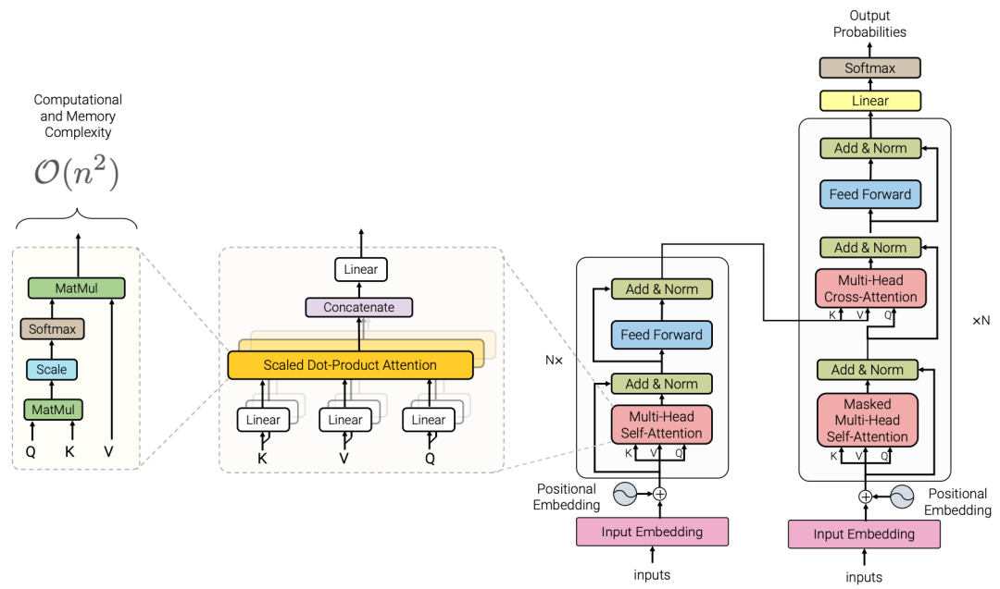
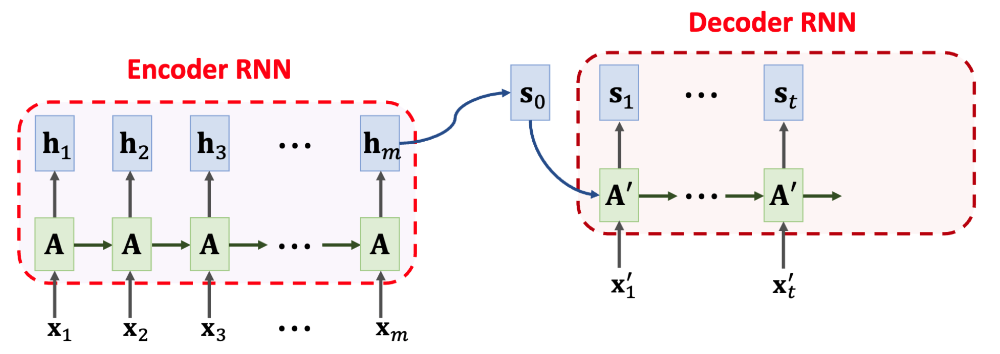
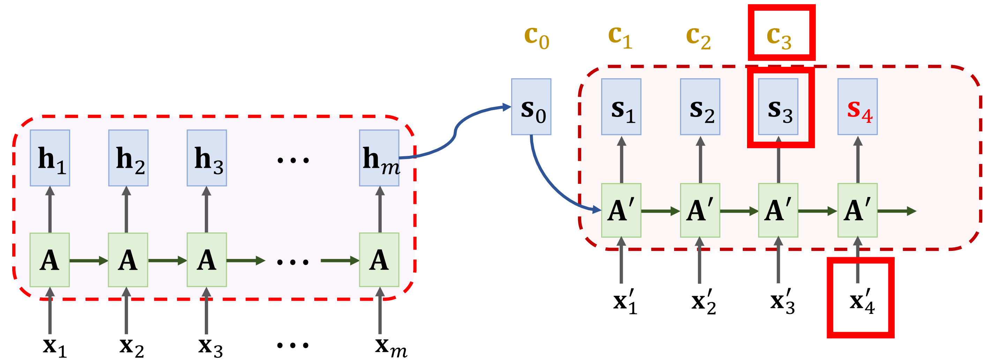
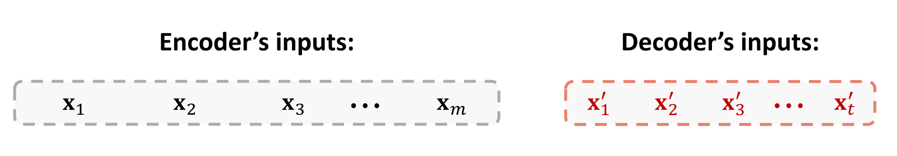
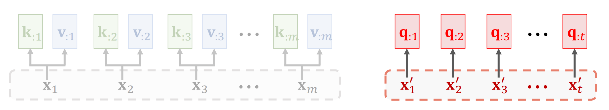
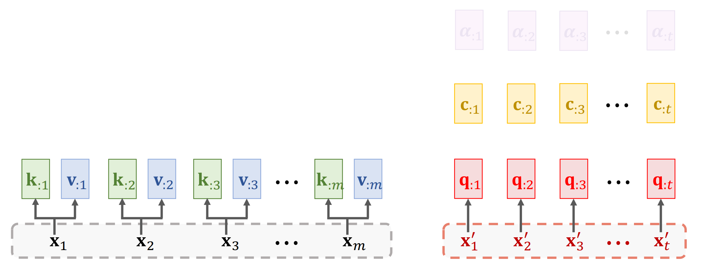

## 0. 写在前面

为什么有这篇文章？

希望自己可以以此为切入点详细过一遍 LLM 相关的知识点和实现细节。

同时，多年来的科研和工作经历中体会到了知识只【输入】往往只会停留在似是而非的程度，只有【输出】才能真正内化成自己的东西。而且，【输出】的的逻辑性和组织性本身也是一种能力的培养。

希望这会是一个系列文章，可以一直更新下去。

在过程中我会尽量保持一些原则在脑海中：

### 知识点的结构性

很多时候知识点是杂乱的，尤其是 LLM 如此庞大的一个系统，有着茫茫多的细节，需要时刻把握细节之间的关联和在整体中的位置。

### 实现细节

“知道”和“用过”的本质区别，在于是否能够实现一个东西。这也是为什么这个系列会希望可以真正上手做一些东西。

另外，能真正把一个东西用自己的手做出来也是很令人兴奋的。

### 业务场景和能力边界

毕竟是 Engineer，而不是 Researcher，所以相比于刷榜和刷论文，更关心的是如何把这些东西真正落地和影响业务。因此，技术能力的边界尤其重要。

作为一个“资深”算法工程师，我们每天面对的问题更多的不是【正确答案】和【错误答案】，而是【不那么差的错误答案】和【不那么好的正确答案】。换句话说，我们往往需要在不同的维度上进行权衡，从技术的优劣势中筛选可用部分，而不是简单的“对”和“错”。这样的权衡一方面需要我们有足够精准的业务理解，另一方面也需要我们对业务有足够的研判。

### 坚持

说了这么多，最重要的还是坚持。

***时间的积累是一种力量，而坚持是积累的唯一方式。***

## 1. 从 RNN 到 Transformer

要聊 LLM，事情当然要从 Transformer 说起。没有 Transformer，就没有 LLM。而 Transformer 的出现，也是为了解决 RNN/LSTM 的缺陷。

### Transformer 的概念性信息

Transformer 是 OpenAI 在 2017 年提出的一个模型。关于名称由来，有说是取【转换】的意思，也有说是取【变形金刚】的意思。不管怎么说，Transformer 的提出是 NLP 领域的一个里程碑式的事件。

它的出现，将之前各个领域中的专用模型训练范式逐渐统一到了一个通用的范式之下 - Transformer 基础上的 vector 化。具体细节后面会逐渐展开。

首先有个概念，Transformer 的完全体是一个 seq2seq 模型，它的输入是一个序列。因此，很自然地就能想到其和前任 seq2seq 霸主 RNN 一定有着千丝万缕的联系。

先贴出一个基本都见过的 Transformer 的结构图，不用太在意细节，后面会逐渐展开。

<!-- 

 -->

### RNN/LSTM

经典 RNN Seq2Seq 模型是一个 Encoder-Decoder 模型:

- 它的 Encoder 部分是一个 RNN，它的输出是一个固定长度的向量 $h$，这个向量蕴含了整个序列的语义信息
- 而 Decoder 部分也是一个 RNN，它的输入就是上面 Encoder 输出的向量 $h$，它的输出是一个新序列。

### Attention 的出现逻辑

但 RNN 的结构天生存在缺陷。

可以看到，上图中的结构，表明了每次 RNN / LSTM 只能输出一个单词/token，同时能看到的信息也只有从前一个 token 生成时传来的语义信息（$h$ 向量）；即使在改进版的 LSTM 中又加入了一个记忆向量，这样也仅仅多了一个向量（$c$ 和 $h$）。可以理解成编码器每个 token 的语义迭代压缩后得到的向量表示。这些向量可携带的语义信息本就有限，更糟的是，这些向量会经过漫长的序列传递，每步在经过 RNN 网络时都必然会有参数矩阵运算后的向量映射（偏移）——即使门控单元尽最大可能在缓解这种问题——这种偏移对于长序列是一种累加误差，信息的丢失极其严重。

为解决这个问题，一个很朴素的想法就是，将每一步生成的这些隐变量 $h$ 或 $c$ 不通过 RNN 传递，而是直接被 Decoder 取用，类似 ResNet 的结构。如此就可以减少信息的丢失。但是，如果像 highway connection 一样将每个 Encoder 中的 $h$ 向量原样传给 Decoder，几不可能亦无必要：输入序列可能很长（假设为 $n$），全部传过去将是很大的运算开销；而且通过我们对自然语言的理解，并不是每个输入字符都对输出具有相同的重要性。

因此，Decoder 应该采用何种策略来经济实惠地取用 $h$ 呢？

我们可以思考：

1. 每个 token 映射的向量都包含了该 token 的语义信息
2. 通过 RNN 后，该向量同时还包含了前面所有 token 的语义信息，这一步就有了冗余
3. 对于 Encoder 生成的 $n$ 个 $h$ 向量，我们可以有两种处理方法：
   1. 直接将它们拼接起来，组成一个 $n \times d$ 的矩阵，其中 $d$ 是每个向量的维度，这样就可以将所有的语义信息都传递给 Decoder 了，但是后续处理如此大维度且变长向量会很麻烦
   2. pooling，将 $n$ 个向量进行池化，得到一个 $d$ 维的向量，这样就可以将所有的语义信息都传递给 Decoder 了，但是这样做会丢失很多信息

Attention 的出现就是为了解决这些问题

### Attention 的思路

> 首先要说明，这里的 Attention 还是服务于 RNN Encoder-Decoder 架构的方法，它是为了解决 RNN 对于长序列的处理问题而提出的。离 Transformer 中的 self-Attention 还有一段距离。

首先直接给出 Attention 的核心思想: **将 Encoder 生成的 $n$ 个 $h$ 向量进行加权求和，得到一个 $d$ 维的向量，这样就可以将所有的语义信息都传递给 Decoder 了，同时还可以保留更多的信息。**

然后我们来理解一下这么做的逻辑。

具体地，我们回顾上面提到的 Encoder-Decoder 模型结构，

如上所述，我们希望在解码器 $A'$ 生成 $S_1$ 的时候，可以直接从编码器部分每个输入 token 对应的隐变量输出 $h_1...h_m$ 获取必要的信息。

具体的获取方式可以理解成一种“照方抓药”——根据我现在遇到的什么病（$x'_i$ 或者 $S_i$ 向量）来决定我抓什么和抓多少药（$h_1...h_m$ 向量）

公式化写一下就是：
$$
\begin{equation}
c_i = \sum_{j=1}^{m} \alpha_{ij} h_j
\end{equation}
$$

其中

- $i \in [0, n]$ 为输出序列的第 $i$ 个 token
- $c_i$ 是 $x'_i$ 的注意力向量——这就是配出的“成品药”
- $S_i$ 是 输出 token $x'_i$ 的信息向量——这是我现在的“病”
- $h_j$ 是 输入 token $x_j$ 的信息向量——这是“一味药材”
- 加权权重 $\alpha_{ij}$ 是 $S_i$ 和 $h_j$ 的关联度，决定了 $h_j$ （亦即$x_j$） 对 $S_i$ 的影响程度——这是我们根据”病“和”药“的关联度来决定”方子“

关键点在于”方子“ $\alpha_{ij}$ 的计算。在最早提出 Attention 的论文中引入了一个“对齐”函数来评估 $S_i$ 和 $x_j$ 的关联度，这个函数可以是任意的，但是要求它的输出是一个标量：
$$
\begin{equation}
\alpha_{ij} = align(S_i, h_j)
\end{equation}
$$

比如常见的内积函数：
$$
\begin{equation}
inner(S_i, h_j) = S_i^T h_j
\end{equation}
$$
这样 $c$ 的计算就变成了：
$$
\begin{equation}
c_i = \sum_{j=1}^{m} (S_i^T h_j)h_j
\end{equation}
$$

当然实际中我们一般不会直接拿 $S_i$ 和 $h_j$ 做内积，而是先对 $S_i$ 和 $h_j$ 进行线性变换，然后再做内积：

$$
\begin{align}
q_i &= W_q S_i \newline
k_j &= W_k h_j
\end{align}
$$

同样，作为被取用信息的 $h_j$ 也需要经过线性变换：
$$
\begin{equation}
v_j = W_v h_j
\end{equation}
$$

这样，$c_i$ 的计算就进一步变成了：
$$
\begin{align}
c_i &= \sum_{j=1}^{m} (q_i^T k_j)v_j \newline
&= \sum_{j=1}^{m} (S_i^T W_q^T W_k h_j)W_v h_j
\end{align}
$$

这里的 $W_q, W_k, W_v$ 都是可学习的参数矩阵，它们的作用是将 $S_i$ 和 $h_j$ 映射到一个更高维度的空间，来获得更好的表现能力。

此外，这里已经把表示法变成了 QKV 的形式，分别代表了 Query、Key 和 Value。这和他们的作用是一致的，Query 代表了当前的”病“，Key 代表了”医书中每一位药材的描述（索引）“，我们可以根据”病症“和药材描述的适应症的相关性得到”药方“ $\alpha$。最后根据药方，去按比例抓取具体的”药材“ Value，生成最终的”成品药“ $c$。

最后一步，作为一个加权值，为了让后续计算的分布更加稳定，我们一般会对 $\alpha_{ij}$ 进行 softmax 归一化：
$$
\begin{align}
\alpha_{ij} &= \mathrm{softmax}(inner(q_i, k_j)) \newline
&= \frac{exp(inner(q_i, k_j))}{\sum_{j=1}^{m} exp(inner(q_i, k_j))}
\end{align}
$$

这样，$c_i$ 的计算就变成了完全体：
$$
\begin{align}
c_i &= \sum_{j=1}^{m} \alpha_{ij} v_j \newline
&= \sum_{j=1}^{m} \frac{exp(inner(q_i, k_j))}{\sum_{j=1}^{m} exp(inner(q_i, k_j))} v_j
\end{align}
$$

当然，你也可以使用一个其他函数（甚至是神经网络）来计算这个关联度，只要它能够满足上面的要求即可。

到这里，我们已经获得了比之前的 $S_i$ 更加丰富的信息 $c_i$，它蕴含了所有输入 token 的语义信息，且直接获取，无传递损失。

看起来不错的形式。这时候我们会考虑另一个问题——既然我们已经用”照方抓药“的方式更高效地传递了所有的语义信息，RNN 在这里还是必要的么？

我们不妨试试直接拿掉 RNN，只用 Attention。

### Attention 的完全体

结构变成了上面这样，虽然输入和输出都是一个序列，我们却不再用循环的方式来顺序处理一遍，而是变成了平行的结构，每个 token 都独立映射到自己的 QKV，最终生成 $c$。

对于 Encoder 来说，这种并行结构没有问题，但是对于 Decoder 的预测过程来说，只能通过串行的结构一个一个地生成 $x'_i$。过程为：

1. 根据 $x'_{i-1}$ 生成 $q_i$
2. 根据 $k_j$ 和 $v_j$ 计算 $\alpha_{ij}$
3. 根据 $\alpha_{ij}$ 计算 $c_i$
4. 根据 $c_i$ 计算 $x'_i$——这一步可以利用一个线性变换和一个 softmax 来实现 token 词表的映射
5. 重复 1-4 直到生成 $x'_n$

这种迭代生成的方式，决定了 Decoder 的每一步都依赖于前一步的输出，因此无法并行化，而 Attention 计算又是一个非常耗时的过程，因此成为了目前 Transformer 的一个瓶颈。很多研究在这部分的优化上，后续可以专门写一篇文章来讨论。(TODO 挖坑)

但是仔细观察我们会发现，因为去除了 RNN 结构，我们失去了一个重要的信息——序列的顺序信息。这个信息对于自然语言处理来说是非常重要的，比如在这个结构中处理【我是你爸爸】和【你是我爸爸】这两句话时，KV 是完全一样的，后续解码器看到的”医书“和抓的”药材“都完全一样，很显然开出的”药方“也不会有区别。但是很明显，这两句话的意思有如天渊【于谦老师知道。

因此如果要用 Attention 来处理序列，我们需要引入一些额外的信息来表征序列的顺序信息。

位置编码就是用来解决这个问题的。

#### 位置编码

### Attention 到 self-Attention

### 再加一点佐料

### Transformer 的结构

## 2. 实现一下

### 实现一个 Attention 先

### self-Attention

### 最后是 Transformer

## 3. 有什么问题么
